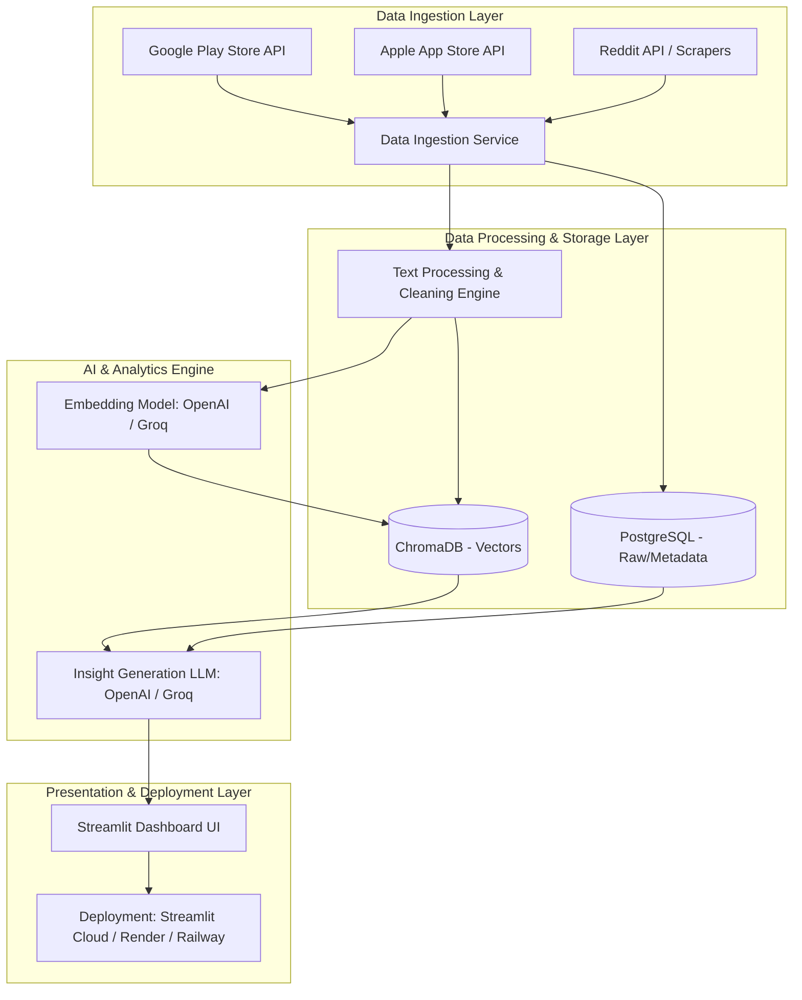

# Technical Architecture: AI-Powered Product Discovery Engine

## 1. Executive Summary
This document outlines the detailed system architecture for the Blinkit Product Discovery Engine, as derived from the project context. The system is designed to automatically ingest, process, and analyze large-scale unstructured user feedback from public channels to uncover product insights, track shopping behaviors, and identify cross-category growth opportunities using a modern, lightweight Python stack.

## 2. System Architecture Diagram

## 3. Layered Architecture Details

### 3.1. Data Ingestion Layer
**Purpose:** Collect public feedback automatically from diverse sources.
*   **Components:**
    *   **API Connectors:** Custom connectors for Google Play Store, Apple App Store, and Reddit APIs.
    *   **Job Scheduler:** A workflow orchestrator (e.g., Apache Airflow or simple Python CRON jobs) to run extraction jobs.
*   **Key Considerations:** Rate limiting handling, deduplication of reviews, and incremental data fetching.

### 3.2. Data Processing & Storage Layer
**Purpose:** Cleanse, normalize, and safely store the unstructured text.
*   **Relational Database (PostgreSQL):** Stores raw metadata (timestamp, source platform, upvotes) and processed clean text. Serves as the primary source of truth.
*   **Vector Database (ChromaDB):** Stores high-dimensional embeddings for semantic search. ChromaDB is ideal for Python-native environments and integrates seamlessly with LLM frameworks.
*   **Text Processing Engine:** Python-based service (using spaCy/NLTK) to strip HTML, normalize unicode, and remove stop words.

### 3.3. AI & Analytics Engine
**Purpose:** Transform text into structured insights, themes, and user segments.
*   **AI Providers (OpenAI or Groq):** Flexible integration allowing the use of OpenAI (for state-of-the-art reasoning) or Groq (for ultra-fast LPU inference).
*   **Embedding Model:** Converts processed text into vectors using OpenAI embeddings or open-source models via Groq.
*   **User Segmentation Engine:** Classifies the author of the feedback into predefined segments (Families, Students, Pet Owners) based on context clues within the text using LLM extraction prompts.
*   **Insight Generation LLM (RAG):** Uses Retrieval-Augmented Generation. The LLM queries ChromaDB for discussions around specific themes (e.g., "barriers to exploring new categories") and synthesizes these into structured hypotheses, complete with citations.

### 3.4. Presentation & Application Layer
**Purpose:** Deliver actionable insights to the Product Management team.
*   **Product Discovery Dashboard (Streamlit):**
    *   A pure Python, rapid-prototyping frontend that queries PostgreSQL and ChromaDB directly, eliminating the need for a separate backend API gateway.
    *   **Trend Visualization:** Charts showing sentiment over time across different categories.
    *   **Cross-Category Heatmap:** Visual matrix highlighting opportunities where users of Category A show intent/interest in Category B.
    *   **Evidence Viewer:** A drill-down feature that lets PMs view the raw, anonymized user quotes that generated the insight.

## 4. Addressing Key Product Questions
*   **Shopping Behaviour:** Addressed by the User Segmentation Engine and time-series analysis of recurring mentions.
*   **Category Discovery:** Addressed by thematic clustering of negative sentiment specifically surrounding the "search" or "first-time purchase" experience.
*   **User Frustrations:** Addressed by the Insight Generation LLM summarizing the top 5 pain points weekly.

## 5. Deployment Requirements
*   **Deployment Platforms:** The application is lightweight enough to be deployed on **Streamlit Cloud**, **Render**, or **Railway** for fast go-to-market without complex Kubernetes overhead.
*   **Cost & Performance Management:** Toggle between OpenAI and Groq depending on the need for complex reasoning vs. ultra-fast, cost-effective summarization.
